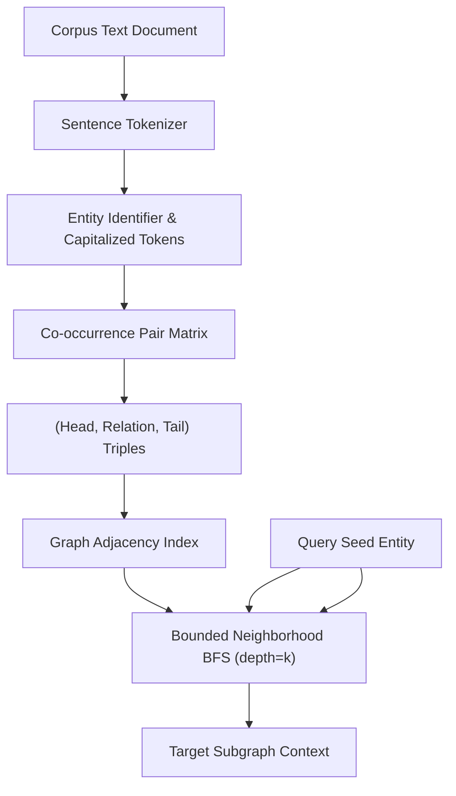

# genpark-graph-rag-entity-relationship-extractor-skill

Agent Skill implementing **GraphRAG Entity-Relationship Extraction & Subgraph Neighborhood Retrieval** in 100% pure Python standard library.

## Architectural Flow

